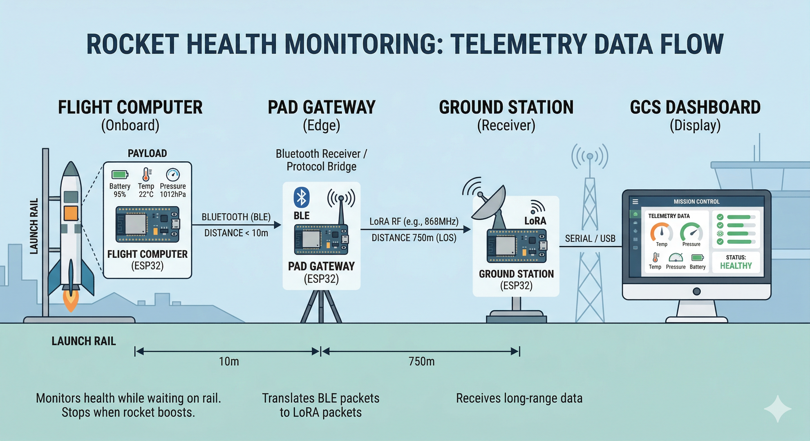
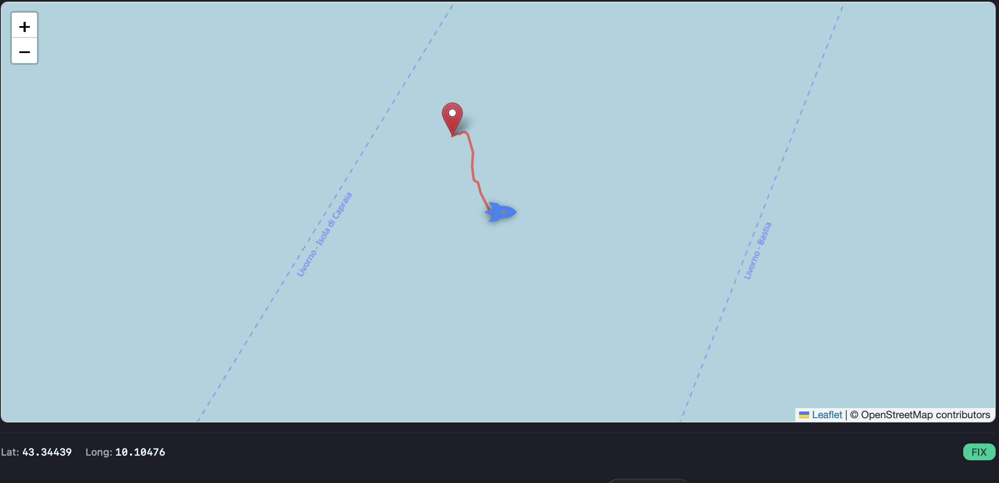

# Updates: March 30, 2026

## Onboard SW

- 2 states (sys_init and Power-on Self-Check) out of 5 are already implemented for all sensors and logging modules. Missing: ARMED, BOOST and, COAST.

- GPS data stream is implemented at 80%, ARMED state included. Missing Data Logging for BOOST and COAST modes and it will be at 100%.

- Original Frame was modified for a smaller packet. Removing redundant information (6 bytes smaller per frame), fully implemented.

- A new architecture for health monitoring was established (due to the LoRA confusion going around),  see Figure:

  

  - Flight Computer to Pad Gateway link is working at 50%. Pad Gateway to ground station is missing.

## Ground SW

- Front-end: Dashboard is ready at 80%, being tested using random generated data.
- Front-end: Game-oriented features were added for *Scuola Superiore* exhibition show, which includes a Human-Machine Interface for *Airbrake* game. 
- Back-end: Frame parser is fully implemented and fully parsing the GPS Data.
- Back-end: Currently, integrating GPS Data for real-time health monitoring on Dashboard. 

### Dashboard 

- Added a live map view for telemetry tracking. It allows users to monitor the rocket's exact current location, trace its historical flight path, and clearly identify the initial launch site.

# Next Steps

## Onboard SW

- Aligning remainder sensors with current GPS progress in the following order: 
  1. Power sensor (INA219), 
  2. Atmospheric sensor (BME680)
  3. IMU Module (MPU6050)
- Data Logging Implementation.
